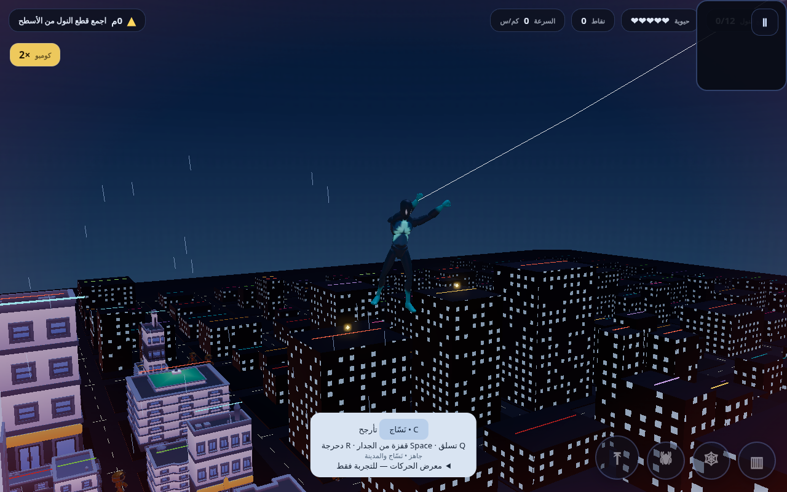

# لَزِج — نَسّاج المدينة · v1.4

لعبة عالم مفتوح منخفض التفاصيل بواجهة عربية: عنكبوت آلي مترابط وبطل بشري أصلي قابلان للتبديل، مدينة من 681 مبنى، تسلق وتأرجح، حملة تنتهي بقتال زعيم وسباق أسطح.

**[العب في المتصفح](https://mohareb123.github.io/LazijDrownedCity/)** · **[تحميل Windows x64](https://github.com/mohareb123/LazijDrownedCity/releases/tag/v1.0)**



## التحكم
WASD حركة · Shift جري · Space قفز · E تأرجح · Q تسلق · Q+S نزول · C تبديل الشخصية · F شبكة هجومية · R دحرجة · T رقصة · M سباق · V منظور · ESC إيقاف.

اجمع 8 قطع من النول، اصعد البرج الأوسط، واضرب الزعيم 3 ضربات تفصل بينها مهلة قصيرة. بعد النهاية يمكنك استكشاف المدينة وجمع القطع المتبقية.

## التشغيل المحلي
من جذر المستودع:
```sh
python3 -m http.server 8080
```
افتح http://localhost:8080. جميع النماذج محلية؛ لا يحتاج التشغيل إلى شبكة بعد تنزيل المستودع كاملًا.

## إعادة البناء والاختبار
```sh
python3 build_open.py
cp open-world.html index.html
python3 gen_harness.py
node harness_openworld.mjs
bash pc/build_exe.sh
```
حزمة Windows داخل LazijCity-win64.zip؛ استخرجها كاملة ثم شغّل LazijCity.exe.

- [دليل الإصدار والميزات وحدود الاختبار](RELEASE-v1.4.md)
- [حقوق النماذج](models/CREDITS.md)
- [نتائج سيناريو المتصفح](tests/release-qa.json)
- [اختبارات الفيزياء والتسلق 14/14](tests/release-physics.txt)

البطل «نَسّاج» ليس شخصية مارفل/سبايدر مان الرسمية. تحريك التسلق والتأرجح إجرائي فوق مكتبة CC0. تصادم المباني صندوقي ولا توجد مساحات داخلية. الحزمة مبنية ومحتوياتها مفحوصة؛ لم تُجرَ تجربة تشغيل على جهاز Windows فعلي داخل بيئة التطوير.
